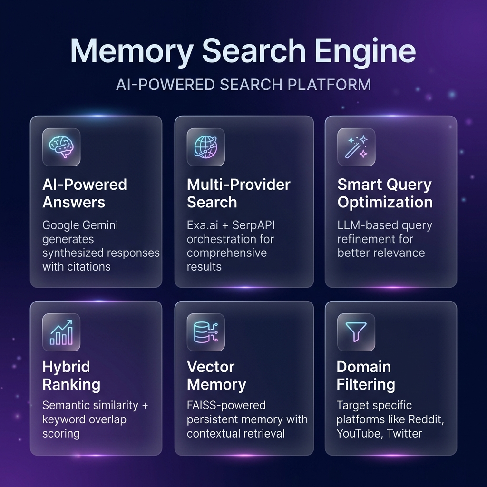
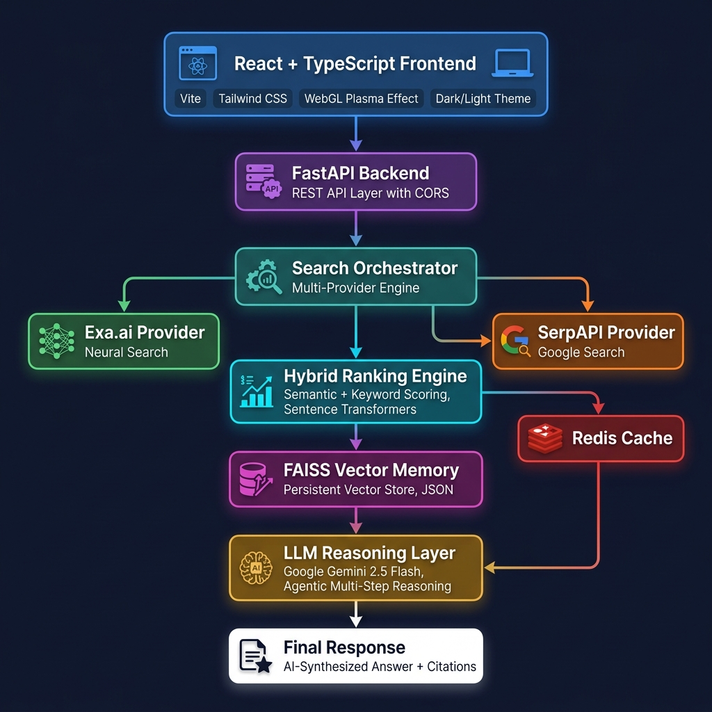
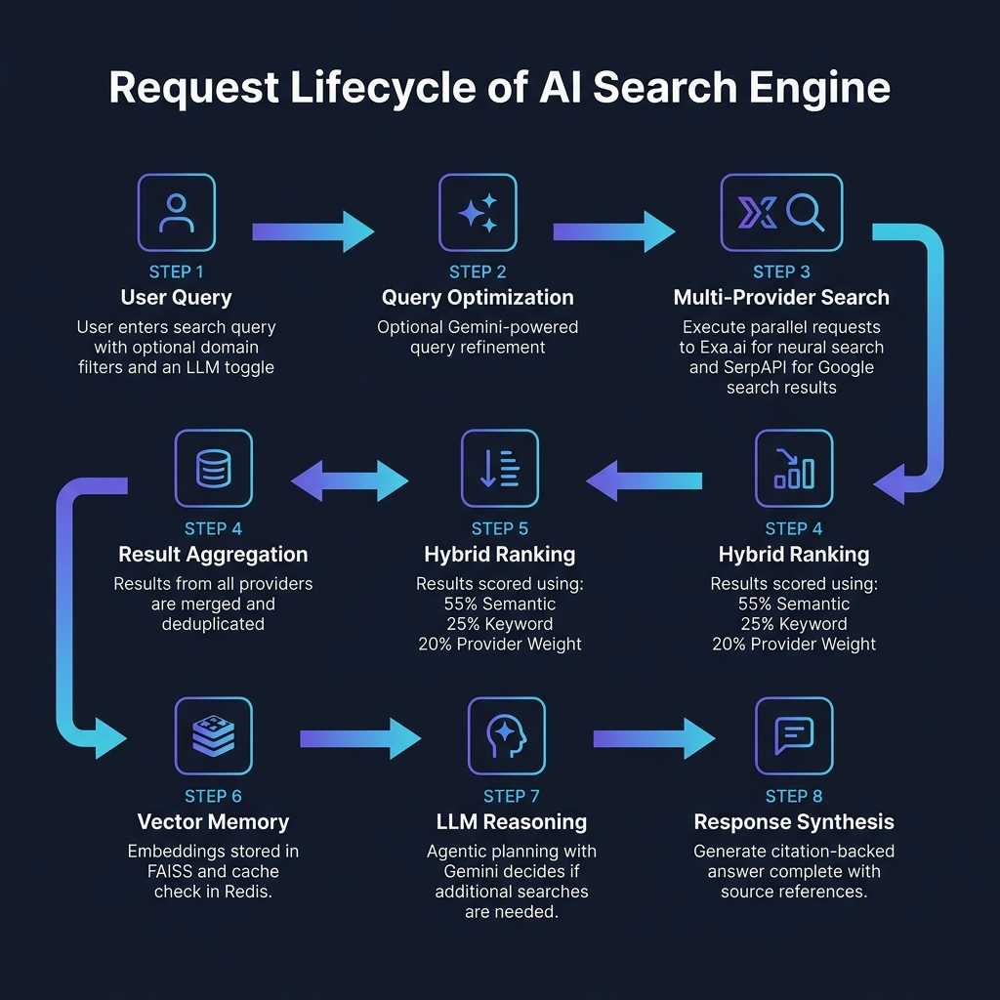

<p align="center">
  
</p>

<h1 align="center">🧠 Memory Search Engine</h1>

<p align="center">
  <strong>AI-Powered Retrieval-Augmented Search Platform</strong>
</p>

<p align="center">
  
  
  
  
  
  
</p>

<p align="center">
  
  
  
</p>

---

## 📋 Table of Contents

- [Overview](#-overview)
- [Live Preview](#-live-preview)
- [Key Features](#-key-features)
- [System Architecture](#-system-architecture)
- [Tech Stack](#-tech-stack)
- [Getting Started](#-getting-started)
  - [Prerequisites](#prerequisites)
  - [Environment Configuration](#environment-configuration)
  - [Option A: Docker (Recommended)](#option-a-docker-recommended)
  - [Option B: Manual Setup](#option-b-manual-setup)
- [Project Structure](#-project-structure)
- [API Reference](#-api-reference)
- [How It Works](#-how-it-works)
- [Design Highlights](#-design-highlights)
- [Contributing](#-contributing)
- [License](#-license)

---

## 🔍 Overview

Traditional search engines return a list of links. **Memory Search Engine** goes further by combining **multi-provider web search** with **advanced LLM reasoning** to deliver synthesized, citation-backed answers — not just links.

Built on **Retrieval-Augmented Generation (RAG)** principles, the platform:

- 🌐 **Aggregates** results from multiple search providers simultaneously
- 📊 **Ranks** results using a hybrid semantic + keyword scoring algorithm
- 🤖 **Generates** AI-synthesized answers using **Google Gemini 2.5 Flash**
- 📝 **Cites** every claim with transparent source references
- 🧠 **Remembers** past searches using FAISS vector memory for contextual retrieval
- 🎨 **Delivers** a polished, interactive UI with WebGL visual effects

---

## 🖼️ Live Preview

<p align="center">
  
</p>

<p align="center"><em>Search interface with WebGL plasma background, domain filtering, and smart query optimization</em></p>

---

## ✨ Key Features

<p align="center">
  
</p>

### 🤖 AI-Generated Answers (Google Gemini)
- Synthesized summaries powered by **Google Gemini 2.5 Flash**
- Context-aware reasoning over retrieved documents
- Source-grounded responses with `[1]`, `[2]` citation format
- Agentic multi-step reasoning for complex queries

### 🌐 Multi-Provider Search Orchestration
- **Exa.ai** — Neural semantic search with deep web coverage
- **SerpAPI** — Google Search results via structured API
- Extensible provider architecture (easily add Brave, Bing, etc.)

### 🧹 Smart Query Optimization
- Optional LLM-powered query refinement via Gemini
- Transforms vague queries into precise, optimized search terms
- Platform-aware rewriting (X/Twitter, Reddit, YouTube, etc.)

### 🎯 Domain-Based Filtering
- Restrict results to specific platforms:
  - X (Twitter), Threads, TikTok, Reddit, YouTube, Instagram
- Clean domain normalization with strict post-filtering

### 📊 Hybrid Ranking Algorithm
| Weight | Signal              | Source                    |
|--------|---------------------|---------------------------|
| 55%    | Semantic Similarity | Sentence Transformers     |
| 25%    | Keyword Overlap     | Token-level matching      |
| 20%    | Provider Weight     | Source reliability scoring |

### 🧠 Vector Memory (FAISS)
- Persistent vector storage using FAISS (`IndexFlatL2`)
- Sentence Transformer embeddings (`all-MiniLM-L6-v2`, 384-dim)
- JSON metadata store with timestamps
- Automatic memory recall before hitting external APIs

### 🎨 Interactive Frontend
- **WebGL Plasma Background** — Real-time animated shader effect using OGL
- **Dark / Light Theme** — Smooth animated transitions with color interpolation
- **Glassmorphism UI** — Backdrop blur, translucent cards, rounded corners
- **Responsive Design** — Mobile-first with adaptive layouts
- **Loading States** — Skeleton loaders, spinners, and transition animations

---

## 🏗️ System Architecture

<p align="center">
  
</p>

```
┌─────────────────────────────────────────────────────────────┐
│                    FRONTEND (Client)                         │
│  React 18 + TypeScript + Vite + Tailwind CSS + OGL (WebGL)  │
└────────────────────────────┬────────────────────────────────┘
                             │ HTTP POST /search
                             ▼
┌─────────────────────────────────────────────────────────────┐
│                    FASTAPI BACKEND                           │
│                    (REST API + CORS)                          │
├─────────────────────────────────────────────────────────────┤
│                                                              │
│  ┌──────────────┐    ┌──────────────────────────────┐       │
│  │ LLM Query    │    │   Search Orchestrator         │       │
│  │ Optimizer    │───▶│                                │       │
│  │ (Gemini)     │    │  ┌──────────┐  ┌───────────┐ │       │
│  └──────────────┘    │  │ Exa.ai   │  │ SerpAPI   │ │       │
│                      │  │ Provider │  │ Provider  │ │       │
│                      │  └──────────┘  └───────────┘ │       │
│                      └───────────┬──────────────────┘       │
│                                  │                           │
│  ┌──────────────┐    ┌───────────▼──────────────────┐       │
│  │ Redis Cache  │◀──▶│   Hybrid Ranking Engine       │       │
│  │ (6hr TTL)    │    │   Semantic + Keyword + Weight │       │
│  └──────────────┘    └───────────┬──────────────────┘       │
│                                  │                           │
│  ┌──────────────┐    ┌───────────▼──────────────────┐       │
│  │ FAISS Vector │◀──▶│   LLM Reasoning Layer         │       │
│  │ Memory Store │    │   (Gemini 2.5 Flash)          │       │
│  └──────────────┘    │   Agentic Planning + Synthesis│       │
│                      └───────────┬──────────────────┘       │
│                                  │                           │
│                      ┌───────────▼──────────────────┐       │
│                      │   Response Builder             │       │
│                      │   AI Answer + Citations        │       │
│                      └──────────────────────────────┘       │
└─────────────────────────────────────────────────────────────┘
```

> **📖 For a detailed system design document with data flow diagrams, component breakdowns, and design rationale, see [`SYSTEM_DESIGN.md`](SYSTEM_DESIGN.md)**

---

## 🛠️ Tech Stack

### Backend
| Technology | Purpose |
|---|---|
| **FastAPI** | High-performance async REST API framework |
| **Google Gemini** (`google-generativeai`) | LLM reasoning, query optimization, answer synthesis |
| **Exa.ai** (`exa_py`) | Neural semantic web search provider |
| **SerpAPI** | Google Search results via structured API |
| **Sentence Transformers** | Text embeddings (`all-MiniLM-L6-v2`) |
| **FAISS** (`faiss-cpu`) | Vector similarity search and persistent memory |
| **Redis** | Response caching with configurable TTL |
| **Pydantic** | Data validation and serialization |
| **NumPy** | Numerical computations for scoring |
| **python-dotenv** | Environment variable management |

### Frontend
| Technology | Purpose |
|---|---|
| **React 18** | Component-based UI framework |
| **TypeScript** | Type-safe JavaScript development |
| **Vite** | Next-generation frontend build tool |
| **Tailwind CSS** | Utility-first CSS framework |
| **OGL** | WebGL library for plasma shader effects |
| **Lucide React** | Modern icon library |

### Infrastructure
| Technology | Purpose |
|---|---|
| **Docker** + **Docker Compose** | Containerized deployment |
| **Redis 7 (Alpine)** | Lightweight cache container |
| **Python 3.10** | Runtime environment |

---

## 🚀 Getting Started

### Prerequisites

| Requirement | Version |
|---|---|
| Python | 3.8+ |
| Node.js | 16+ |
| Docker & Docker Compose | Latest (recommended) |

### Environment Configuration

Create a `.env` file inside the `backend/` directory:

```env
# ============================================
# Memory Search Engine — Environment Variables
# ============================================

# Required: Google Gemini API Key
# Get yours at: https://aistudio.google.com/apikey
GEMINI_API_KEY=your_gemini_api_key_here

# Required: Exa.ai API Key
# Get yours at: https://exa.ai
EXA_API_KEY=your_exa_api_key_here

# Required: SerpAPI Key
# Get yours at: https://serpapi.com
SERPAPI_KEY=your_serpapi_key_here

# Optional: Brave Search API Key (for future use)
# BRAVE_API_KEY=your_brave_api_key_here

# Optional: Redis Configuration (defaults shown)
# REDIS_HOST=127.0.0.1
# REDIS_PORT=6379
# REDIS_DB=0
```

> **🔑 API Key Setup Guide:**
>
> 1. **Google Gemini** — Visit [Google AI Studio](https://aistudio.google.com/apikey), sign in with your Google account, and generate a free API key. The project uses `gemini-2.5-flash` model.
> 2. **Exa.ai** — Sign up at [exa.ai](https://exa.ai) for neural search API access.
> 3. **SerpAPI** — Register at [serpapi.com](https://serpapi.com) for Google Search API access.

---

### Option A: Docker (Recommended)

The fastest way to get running. Docker handles Redis, backend, and all dependencies.

```bash
# 1. Clone the repository
git clone https://github.com/your-username/memory-search-engine.git
cd memory-search-engine

# 2. Configure environment
cp backend/.env.example backend/.env
# Edit backend/.env with your API keys

# 3. Build and launch
docker-compose up --build
```

| Service | URL |
|---|---|
| Backend API | `http://127.0.0.1:8000` |
| Redis | `localhost:6379` |

Then start the frontend separately:

```bash
cd frontend
npm install
npm run dev
```

| Service | URL |
|---|---|
| Frontend | `http://localhost:5173` |

---

### Option B: Manual Setup

#### 1. Backend Setup

```bash
# Navigate to backend
cd backend

# Create virtual environment
python -m venv venv

# Activate (Windows)
venv\Scripts\activate

# Activate (macOS/Linux)
source venv/bin/activate

# Install dependencies
pip install -r requirements.txt

# Ensure Redis is running locally
# Windows: Use Docker or Redis for Windows
# macOS: brew install redis && redis-server
# Linux: sudo apt install redis-server && sudo systemctl start redis

# Start the backend server
uvicorn app:app --reload
```

#### 2. Frontend Setup

```bash
# In a new terminal
cd frontend

# Install dependencies
npm install

# Start development server
npm run dev
```

#### 3. Access the Application

| Service | URL |
|---|---|
| Frontend | `http://localhost:5173` |
| Backend API | `http://127.0.0.1:8000` |
| API Docs (Swagger) | `http://127.0.0.1:8000/docs` |

---

## 📁 Project Structure

```
memory-search-engine/
│
├── 📄 README.md                    # This file
├── 📄 SYSTEM_DESIGN.md             # Detailed system architecture document
├── 📄 docker-compose.yml           # Docker orchestration (Redis + Backend)
├── 🖼️ preview.png                  # UI screenshot
│
├── 📁 docs/
│   └── 📁 images/                  # Architecture diagrams and screenshots
│       ├── hero_banner.png
│       ├── system_architecture.png
│       ├── features_overview.png
│       └── data_flow_diagram.png
│
├── 📁 backend/                     # FastAPI Python backend
│   ├── 📄 app.py                   # FastAPI application & /search endpoint
│   ├── 📄 orchestrator.py          # Multi-provider search orchestration
│   ├── 📄 reasoner.py              # LLM reasoning layer (Gemini agentic)
│   ├── 📄 search.py                # Core search engine & embedding logic
│   ├── 📄 llm.py                   # Gemini query optimization module
│   ├── 📄 ranking.py               # Hybrid ranking algorithm
│   ├── 📄 models.py                # Pydantic data models (SearchItem)
│   ├── 📄 cache.py                 # Redis caching utilities
│   ├── 📄 load_env.py              # Universal environment loader
│   ├── 📄 requirements.txt         # Python dependencies
│   ├── 📄 Dockerfile               # Backend container definition
│   ├── 📁 providers/               # Search provider implementations
│   │   ├── 📄 base.py              # Abstract SearchProvider base class
│   │   ├── 📄 exa_provider.py      # Exa.ai neural search provider
│   │   └── 📄 serpapi_provider.py   # SerpAPI Google search provider
│   └── 📁 vector_memory/           # FAISS vector store
│       ├── 📄 vector_store.py      # Vector indexing & similarity search
│       └── 📄 memory.json          # Persistent metadata store
│
└── 📁 frontend/                    # React TypeScript frontend
    ├── 📄 index.html               # HTML entry point
    ├── 📄 package.json             # Node.js dependencies
    ├── 📄 vite.config.ts           # Vite build configuration
    ├── 📄 tailwind.config.js       # Tailwind CSS configuration
    └── 📁 src/
        ├── 📄 App.tsx              # Main application component
        ├── 📄 main.tsx             # React DOM entry point
        ├── 📄 index.css            # Global styles
        ├── 📁 components/
        │   ├── 📄 Plasma.tsx       # WebGL plasma shader effect (OGL)
        │   ├── 📄 AnswerPanel.tsx  # AI-generated answer display
        │   ├── 📄 SearchForm.tsx   # Search input with domain filters
        │   ├── 📄 SearchResults.tsx # Results list container
        │   ├── 📄 SearchResultCard.tsx # Individual result card
        │   ├── 📄 DomainSelector.tsx   # Domain filter chips
        │   └── 📄 ThemeToggle.tsx  # Dark/Light mode switch
        ├── 📁 types/
        │   └── 📄 index.ts        # TypeScript type definitions
        └── 📁 utils/
            └── 📄 highlightKeywords.ts # Keyword highlighting utility
```

---

## 📡 API Reference

### `POST /search`

Performs a multi-provider search with optional AI optimization and reasoning.

**Request Body:**

```json
{
  "query": "How does RAG work in AI search engines?",
  "domains": ["https://www.reddit.com", "https://www.youtube.com"],
  "num_results": 10,
  "use_llm": true
}
```

| Field | Type | Required | Default | Description |
|---|---|---|---|---|
| `query` | `string` | ✅ | — | The search query |
| `domains` | `string[]` | ❌ | `null` | Filter results to specific domains |
| `num_results` | `int` | ❌ | `10` | Number of results to return (1–50) |
| `use_llm` | `bool` | ❌ | `false` | Enable Gemini query optimization |

**Response:**

```json
{
  "results": [
    {
      "title": "Understanding RAG Architecture",
      "url": "https://example.com/rag-guide",
      "text": "Retrieval-Augmented Generation combines...",
      "provider": "exa",
      "semantic_score": 0.87,
      "keyword_score": 0.65,
      "final_score": 0.79
    }
  ],
  "answer": "RAG (Retrieval-Augmented Generation) works by...[1][2]",
  "citations": [
    { "index": 1, "url": "https://example.com/rag-guide" },
    { "index": 2, "url": "https://example.com/ai-search" }
  ],
  "effective_query": "RAG retrieval augmented generation AI search architecture",
  "providers_used": ["exa", "serpapi"],
  "llm_used": true,
  "llm_debug": "original_query='How does RAG work?', normalized_query='RAG retrieval augmented generation AI search architecture'"
}
```

---

## ⚙️ How It Works

<p align="center">
  
</p>

### Request Lifecycle

```
User Query → [Query Optimization] → Multi-Provider Search → Result Aggregation
     → Hybrid Ranking → Vector Memory → LLM Reasoning → Response Synthesis
```

1. **User submits a query** through the React frontend with optional domain filters and LLM toggle
2. **Query Optimization** *(optional)* — Gemini rewrites vague queries into precise search terms
3. **Orchestrator** dispatches the query to **Exa.ai** (neural search) and **SerpAPI** (Google) in parallel
4. **Results are aggregated** and deduplicated by URL
5. **Hybrid Ranking** scores each result: `55% semantic + 25% keyword + 20% provider weight`
6. **Vector Memory** stores embeddings in FAISS for future contextual recall
7. **LLM Reasoning** *(agentic)* — Gemini evaluates result quality and may trigger additional searches
8. **Synthesis** — Gemini composes a final answer with inline citations

### Agentic Reasoning (Auto-Triggered)

For complex queries (questions, comparisons, long queries), the system activates **agentic mode**:

- **Step 1:** Gemini evaluates if current results are sufficient
- **Step 2:** If needed, generates refined sub-queries
- **Step 3:** Executes additional searches via the orchestrator
- **Step 4:** Merges new results and re-evaluates (up to 2 rounds)
- **Step 5:** Synthesizes the final citation-backed answer

---

## 🎨 Design Highlights

| Principle | Implementation |
|---|---|
| **RAG Architecture** | Retrieval → Ranking → Augmented Generation pipeline |
| **Hybrid Scoring** | Combines neural embeddings with keyword matching |
| **Modular Providers** | Abstract `SearchProvider` base class for extensibility |
| **Agentic LLM** | Self-evaluating reasoning loop with planning |
| **Vector Memory** | FAISS-powered persistent context store |
| **Cache Layer** | Redis with 6-hour TTL for repeated queries |
| **Modern Frontend** | WebGL shaders, glassmorphism, smooth transitions |
| **Production-Ready** | Docker Compose, env management, error handling |

---

## 🤝 Contributing

Contributions are welcome! Here's how to get started:

1. **Fork** the repository
2. **Create** a feature branch (`git checkout -b feature/amazing-feature`)
3. **Commit** your changes (`git commit -m 'feat: add amazing feature'`)
4. **Push** to your fork (`git push origin feature/amazing-feature`)
5. **Open** a Pull Request

### Ideas for Contribution
- Add a **Brave Search** provider
- Implement **WebSocket** streaming for real-time answer generation
- Add **user authentication** and search history
- Create a **Chrome extension** for instant search
- Implement **answer evaluation** scoring

---

