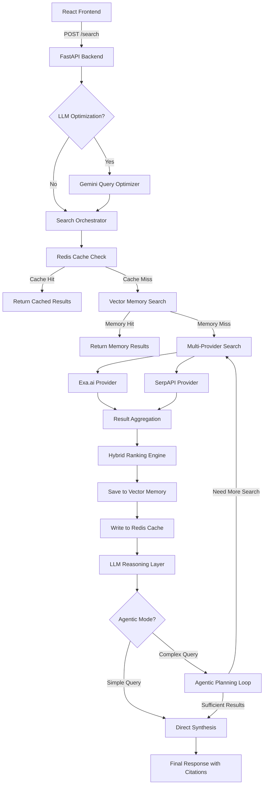

<p align="center">
  
</p>

<h1 align="center">🏗️ System Design — Memory Search Engine</h1>

<p align="center">
  <em>Comprehensive architecture documentation for the AI-Powered Retrieval-Augmented Search Platform</em>
</p>

---

## 📋 Table of Contents

- [1. System Overview](#1-system-overview)
- [2. Architecture Diagram](#2-architecture-diagram)
- [3. Component Breakdown](#3-component-breakdown)
  - [3.1 Frontend Layer](#31-frontend-layer)
  - [3.2 API Layer (FastAPI)](#32-api-layer-fastapi)
  - [3.3 Search Orchestrator](#33-search-orchestrator)
  - [3.4 Search Providers](#34-search-providers)
  - [3.5 Hybrid Ranking Engine](#35-hybrid-ranking-engine)
  - [3.6 Vector Memory (FAISS)](#36-vector-memory-faiss)
  - [3.7 LLM Reasoning Layer](#37-llm-reasoning-layer)
  - [3.8 Caching Layer (Redis)](#38-caching-layer-redis)
- [4. Data Flow](#4-data-flow)
- [5. Agentic Reasoning Architecture](#5-agentic-reasoning-architecture)
- [6. Data Models](#6-data-models)
- [7. Scoring & Ranking Algorithm](#7-scoring--ranking-algorithm)
- [8. Infrastructure & Deployment](#8-infrastructure--deployment)
- [9. Security Considerations](#9-security-considerations)
- [10. Scalability & Future Roadmap](#10-scalability--future-roadmap)

---

## 1. System Overview

Memory Search Engine is a **Retrieval-Augmented Generation (RAG)** platform that combines multi-provider web search with AI-powered reasoning to deliver synthesized, citation-backed answers.

### Core Design Principles

| Principle | Description |
|---|---|
| **Modular Provider Architecture** | Search providers are plug-and-play via abstract base class |
| **Hybrid Intelligence** | Combines semantic embeddings, keyword matching, and LLM reasoning |
| **Memory-First Retrieval** | Vector store is checked before external APIs to reduce latency |
| **Agentic Reasoning** | LLM self-evaluates result quality and triggers additional searches |
| **Defense in Depth** | Multi-layer caching (Redis + Vector) minimizes redundant API calls |
| **Graceful Degradation** | Provider failures don't crash the system; fallbacks are built-in |

### High-Level Architecture

```
┌──────────────┐     HTTP      ┌──────────────┐
│   React UI   │ ◀──────────▶  │   FastAPI     │
│   (Client)   │   POST JSON   │   (Server)    │
└──────────────┘               └──────┬───────┘
                                      │
                    ┌─────────────────┼─────────────────┐
                    │                 │                  │
              ┌─────▼─────┐   ┌──────▼──────┐   ┌──────▼──────┐
              │ Orchestr-  │   │   Ranking   │   │   LLM       │
              │ ator       │   │   Engine    │   │   Reasoner  │
              └─────┬─────┘   └─────────────┘   └─────────────┘
                    │
          ┌────────┼────────┐
          │                 │
    ┌─────▼─────┐    ┌─────▼─────┐
    │  Exa.ai   │    │  SerpAPI  │
    │  Provider │    │  Provider │
    └───────────┘    └───────────┘
```

---

## 2. Architecture Diagram

<p align="center">
  
</p>

### Component Interaction Flow



---

## 3. Component Breakdown

### 3.1 Frontend Layer

**Technology:** React 18 + TypeScript + Vite + Tailwind CSS + OGL

| File | Responsibility |
|---|---|
| `App.tsx` | Main application state, theme management, search orchestration |
| `Plasma.tsx` | WebGL shader effect using OGL (GLSL fragment shader) |
| `SearchForm.tsx` | Query input, domain selection, LLM toggle, result count |
| `AnswerPanel.tsx` | AI-generated answer display with citation links |
| `SearchResults.tsx` | Results list with semantic/keyword score display |
| `DomainSelector.tsx` | Interactive domain filter chips |
| `ThemeToggle.tsx` | Dark/Light mode with animated transition |

**Key Frontend Features:**

- **WebGL Plasma Effect:** Custom GLSL fragment shader rendered via OGL library with 60fps animation, smooth color interpolation between light/dark themes
- **Glassmorphism UI:** `backdrop-blur-xl`, `bg-white/70`, translucent borders
- **Compact Search Bar:** Auto-collapses after first search, expandable overlay modal
- **Theme Animation:** HSL color interpolation with eased `requestAnimationFrame` transitions

```typescript
// Theme color interpolation (App.tsx)
const plasmaColor = mixHexColors(LIGHT_PLASMA_COLOR, DARK_PLASMA_COLOR, themeT);
const plasmaOpacity = lerp(0.8, 0.45, themeT);
```

---

### 3.2 API Layer (FastAPI)

**File:** `backend/app.py`

Single endpoint architecture with a clean request/response model.

```python
# POST /search
class SearchRequest(BaseModel):
    query: str                          # Required search query
    domains: Optional[List[str]]        # Optional domain filters
    num_results: int = 10               # Results count (default: 10)
    use_llm: bool = False               # Enable query optimization
```

**Request Processing Pipeline:**

```
Incoming Request
    │
    ├── [Optional] LLM Query Normalization (Gemini)
    │
    ├── Search Orchestrator (Multi-Provider)
    │
    ├── LLM Reasoning Layer (Gemini)
    │
    └── Response Builder → JSON Response
```

---

### 3.3 Search Orchestrator

**File:** `backend/orchestrator.py`

The orchestrator is the central coordination layer. It implements a **three-tier retrieval strategy:**

```
┌─────────────────────────────────────────┐
│         Search Orchestrator             │
├─────────────────────────────────────────┤
│                                         │
│  Tier 1: Redis Cache                    │
│    └── Check for cached results         │
│    └── Key = hash(query, domains, n)    │
│                                         │
│  Tier 2: FAISS Vector Memory            │
│    └── Embed query → search top-K       │
│    └── Score = 1 / (1 + distance)       │
│    └── Return if relevant hits found    │
│                                         │
│  Tier 3: External API Search            │
│    └── Dispatch to all providers        │
│    └── Aggregate results                │
│    └── Deduplicate + Rank               │
│    └── Save to memory + cache           │
│                                         │
└─────────────────────────────────────────┘
```

**Key Design Decision:** Memory is checked *before* hitting external APIs. This reduces API costs and latency for repeated or similar queries.

---

### 3.4 Search Providers

**Base Class:** `backend/providers/base.py`

```python
class SearchProvider(ABC):
    name: str  # Provider identifier

    @abstractmethod
    def search(self, query: str, domains: Optional[list],
               num_results: int) -> List[SearchItem]:
        ...
```

#### Exa.ai Provider (`exa_provider.py`)

| Feature | Detail |
|---|---|
| Search Type | `keyword` mode (also supports `neural`) |
| Domain Filtering | Native `include_domains` parameter |
| Score Source | Provider confidence score |
| API Client | `exa_py` Python SDK |

#### SerpAPI Provider (`serpapi_provider.py`)

| Feature | Detail |
|---|---|
| Search Engine | Google (`engine: "google"`) |
| Result Source | `organic_results` array |
| Domain Filtering | Post-filtering with URL matching |
| API Client | Direct REST via `requests` |

#### Adding a New Provider

```python
# backend/providers/my_provider.py
from providers.base import SearchProvider
from models import SearchItem

class MyProvider(SearchProvider):
    name = "my_provider"

    def search(self, query, domains=None, num_results=10):
        # Call your API here
        # Return List[SearchItem]
        pass
```

```python
# backend/orchestrator.py — register the provider
from providers.my_provider import MyProvider

orchestrator = SearchOrchestrator(
    providers=[exa, serp, MyProvider()]
)
```

---

### 3.5 Hybrid Ranking Engine

**File:** `backend/ranking.py`

The ranking engine computes a weighted composite score for each result:

```
Final Score = 0.55 × Semantic + 0.25 × Keyword + 0.20 × Provider Weight
```

#### Scoring Components

| Component | Method | Weight |
|---|---|---|
| **Semantic Similarity** | Cosine similarity between query and result embeddings | 55% |
| **Keyword Overlap** | `|query_tokens ∩ result_tokens| / |query_tokens|` | 25% |
| **Provider Weight** | Configurable per-provider reliability score | 20% |

#### Provider Weights

```python
PROVIDER_WEIGHTS = {
    "exa": 1.30,       # Highest trust — neural search
    "brave": 1.00,     # Standard trust
    "serpapi": 0.90,    # Slightly lower (Google scraping)
    # default: 0.80    # Unknown providers
}
```

#### Deduplication Strategy

Two-pass deduplication:
1. **Pre-ranking:** Group by normalized URL, keep the version with the longest `text`
2. **Post-ranking:** Re-dedupe after scoring to preserve the highest-scoring version

```python
def dedupe(items):
    by_url = {}
    for item in items:
        key = item.url.split("?")[0].lower().strip()
        if key not in by_url or len(item.text) > len(by_url[key].text):
            by_url[key] = item
    return list(by_url.values())
```

---

### 3.6 Vector Memory (FAISS)

**File:** `backend/vector_memory/vector_store.py`

| Parameter | Value |
|---|---|
| Index Type | `IndexFlatL2` (exact L2 distance) |
| Embedding Model | `all-MiniLM-L6-v2` |
| Embedding Dimension | 384 |
| Metadata Format | JSON with timestamps |
| Persistence | Binary FAISS index + JSON metadata file |

#### Memory Architecture

```
┌──────────────────────────────────────────┐
│              Vector Memory               │
├──────────────────────────────────────────┤
│                                          │
│  faiss_index.bin                         │
│    └── IndexFlatL2 (384-dim vectors)     │
│    └── Exact nearest neighbor search     │
│                                          │
│  memory.json                             │
│    └── {                                 │
│    └──   "0": {                          │
│    └──     "title": "...",               │
│    └──     "url": "...",                 │
│    └──     "text": "...",                │
│    └──     "provider": "exa",            │
│    └──     "timestamp": 1718000000       │
│    └──   },                              │
│    └──   "1": { ... }                    │
│    └── }                                 │
│                                          │
└──────────────────────────────────────────┘
```

#### Relevance Scoring

```python
# Distance-to-similarity conversion
score = 1 / (1 + distance)
# L2 distance of 0 → score of 1.0 (perfect match)
# L2 distance of 1 → score of 0.5
```

---

### 3.7 LLM Reasoning Layer

**File:** `backend/reasoner.py`

The reasoning layer uses **Google Gemini 2.5 Flash** in two modes:

#### Mode 1: Direct Synthesis (Simple Queries)

For straightforward queries where existing results are sufficient:

```
Results → Gemini Synthesis → Answer + Citations
```

#### Mode 2: Agentic Reasoning (Complex Queries)

For questions, comparisons, and analytical queries:

```
Results → Gemini Planner → [Need more search?]
                              │         │
                             No        Yes
                              │         │
                              │    Sub-Queries → Orchestrator → New Results
                              │         │
                              │    Merge + Dedupe
                              │         │
                              └─────────┘
                                  │
                              Gemini Synthesis → Answer + Citations
```

#### Agentic Decision Criteria

The system automatically activates agentic mode when:

```python
def should_use_agentic(query, results):
    # Question words: why, how, what, explain, compare, analyze
    if tokens[0] in question_starts: return True

    # Explicit questions
    if "?" in query: return True

    # Long queries (8+ words)
    if len(tokens) >= 8: return True

    # Insufficient results
    if len(results) < 3: return True

    return False
```

#### Planner JSON Schema

```json
{
  "need_more_search": true,
  "subqueries": ["refined search 1", "refined search 2"],
  "confidence": 0.65
}
```

- **`confidence ≥ 0.8`** → Stop searching, proceed to synthesis
- **`need_more_search = false`** → Stop searching
- **Max 2 rounds** of additional search (configurable via `MAX_AGENT_STEPS`)

#### Synthesis Prompt Design

```
System: You are an AI answer composer for a multi-provider search engine.
Rules:
  - Use only the provided results as your knowledge
  - Keep answer factual and grounded
  - Do NOT invent URLs or sources
  - Keep the main answer under ~200 words
  - Add a "What this means" section in 2–4 bullet points
  - Use citations like [1], [2] matching numbered sources
```

---

### 3.8 Caching Layer (Redis)

**File:** `backend/cache.py`

| Parameter | Value |
|---|---|
| Backend | Redis 7 (Alpine) |
| Serialization | Python `pickle` |
| Default TTL | 6 hours (21,600 seconds) |
| Key Format | `namespace:query:domains:num_results:use_llm` |

#### Cache Points

| Cache | Key Pattern | TTL | Purpose |
|---|---|---|---|
| Orchestrator Results | `orchestrator:{query}:{domains}:{n}` | 6 hours | Skip full search pipeline |
| LLM Normalization | `llm_norm:{query}:{domains}` | 6 hours | Avoid redundant Gemini calls |

---

## 4. Data Flow

<p align="center">
  
</p>

### Complete Request Lifecycle

```
Step 1: User Input
  └── Query: "How does transformer attention work?"
  └── Domains: ["reddit.com", "youtube.com"]
  └── use_llm: true
  └── num_results: 10

Step 2: Query Optimization (Optional)
  └── Gemini rewrites: "transformer self-attention mechanism explained"
  └── Cached for 6 hours

Step 3: Orchestrator Dispatch
  └── Check Redis Cache → Miss
  └── Check FAISS Memory → Miss
  └── Dispatch to Exa.ai + SerpAPI

Step 4: Multi-Provider Search
  └── Exa.ai: 10 neural results
  └── SerpAPI: 10 Google results
  └── Total: 20 raw results

Step 5: Deduplication
  └── Group by normalized URL
  └── Keep longest text version
  └── Unique results: ~15

Step 6: Hybrid Ranking
  └── Embed each result (384-dim vector)
  └── Score = 0.55 × semantic + 0.25 × keyword + 0.20 × provider
  └── Sort descending → Top 10

Step 7: Memory Storage
  └── Embed each result text
  └── Store in FAISS index
  └── Save metadata to memory.json

Step 8: Redis Cache Write
  └── Cache results with 6-hour TTL

Step 9: Agentic Reasoning (Auto-Triggered)
  └── should_use_agentic("How does...") → True (question word)
  └── Round 1: Planner says confidence: 0.85 → Stop
  └── Direct synthesis

Step 10: Response Synthesis
  └── Gemini composes answer with [1][2][3] citations
  └── Returns: { answer, citations, results, providers_used }
```

---

## 5. Agentic Reasoning Architecture

### Decision Flow

```
                    ┌─────────────────┐
                    │ Initial Results  │
                    └────────┬────────┘
                             │
                    ┌────────▼────────┐
                    │ should_use_      │
               No   │ agentic()?      │  Yes
              ┌─────┤                  ├─────┐
              │     └─────────────────┘     │
              │                              │
     ┌────────▼────────┐          ┌─────────▼─────────┐
     │  Direct          │          │  Agentic Loop      │
     │  Synthesis       │          │  (max 2 steps)     │
     └────────┬────────┘          └─────────┬─────────┘
              │                              │
              │                    ┌─────────▼─────────┐
              │                    │  Gemini Planner    │
              │                    │  → need_more?      │
              │                    │  → subqueries?     │
              │                    │  → confidence?     │
              │                    └─────────┬─────────┘
              │                              │
              │                    ┌─────────▼─────────┐
              │                    │  Execute Sub-      │
              │                    │  Queries via       │
              │                    │  Orchestrator      │
              │                    └─────────┬─────────┘
              │                              │
              │                    ┌─────────▼─────────┐
              │                    │  Merge + Dedupe    │
              │                    │  New Results       │
              │                    └─────────┬─────────┘
              │                              │
              └──────────┬───────────────────┘
                         │
                ┌────────▼────────┐
                │  Final Synthesis │
                │  (Gemini)        │
                └────────┬────────┘
                         │
                ┌────────▼────────┐
                │  JSON Response   │
                │  answer +        │
                │  citations       │
                └─────────────────┘
```

---

## 6. Data Models

### SearchItem (Pydantic)

```python
class SearchItem(BaseModel):
    title: str                              # Page title
    url: str                                # Source URL
    text: str                               # Snippet / content

    # Provider metadata
    provider: str                           # "exa", "serpapi", "memory"
    provider_score: float = 0.0             # Raw provider confidence

    # Optional metadata
    published_at: Optional[str] = None      # Publication date
    author: Optional[str] = None            # Author name

    # Computed scores (set by ranking engine)
    semantic_score: Optional[float] = None  # Cosine similarity
    keyword_score: Optional[float] = None   # Token overlap ratio
    recency_score: Optional[float] = None   # Time-based score
    source_weight: Optional[float] = None   # Provider weight
    final_score: Optional[float] = None     # Weighted composite
```

### SearchRequest

```python
class SearchRequest(BaseModel):
    query: str                              # User's search query
    domains: Optional[List[str]] = None     # Domain filter list
    num_results: int = 10                   # Results to return
    use_llm: bool = False                   # Enable query optimization
```

---

## 7. Scoring & Ranking Algorithm

### Mathematical Formula

```
Score(result) = α × Semantic(q, r) + β × Keyword(q, r) + γ × Weight(provider)

Where:
  α = 0.55   (semantic similarity weight)
  β = 0.25   (keyword overlap weight)
  γ = 0.20   (provider reliability weight)
```

### Semantic Similarity

```
Semantic(q, r) = cos(embed(q), embed(r))
               = (q⃗ · r⃗) / (‖q⃗‖ × ‖r⃗‖)

embed() = SentenceTransformer("all-MiniLM-L6-v2")
          → ℝ³⁸⁴ vector
```

### Keyword Overlap

```
Keyword(q, r) = |tokens(q) ∩ tokens(r)| / |tokens(q)|

tokens(s) = set of lowercase word tokens extracted via regex \w+
```

### Provider Weight

```
Weight(provider) = {
    "exa":     1.30   (neural search, highest trust)
    "brave":   1.00   (standard web search)
    "serpapi":  0.90   (Google API)
    default:   0.80   (unknown providers)
}
```

---

## 8. Infrastructure & Deployment

### Docker Compose Architecture

```yaml
services:
  memorysearch-redis:          # Cache layer
    image: redis:7-alpine
    ports: ["6379:6379"]
    volumes: [redis-data:/data]

  memorysearch-backend:        # API server
    build: ./backend
    ports: ["8000:8000"]
    depends_on: [memorysearch-redis]
    env_file: [./backend/.env]
```

### Container Network

```
┌─────────────────────────────────────┐
│        Docker Network               │
│                                     │
│  ┌──────────┐    ┌──────────────┐  │
│  │  Redis    │◀──▶│   Backend    │  │
│  │  :6379    │    │   :8000      │  │
│  └──────────┘    └──────────────┘  │
│                                     │
└──────────────────┬──────────────────┘
                   │ Port 8000
          ┌────────▼────────┐
          │  Frontend (Dev)  │
          │  :5173           │
          └─────────────────┘
```

---

## 9. Security Considerations

| Area | Implementation |
|---|---|
| **API Keys** | Stored in `.env` file, loaded via `python-dotenv`, excluded from git |
| **CORS** | Configured with `allow_origins=["*"]` (restrict in production) |
| **Input Validation** | Pydantic models validate all request data |
| **Error Handling** | Provider failures are caught and logged, not exposed to client |
| **Cache Serialization** | Pickle-based (consider JSON for untrusted environments) |

### Production Recommendations

- [ ] Restrict CORS origins to your frontend domain
- [ ] Add rate limiting (e.g., `slowapi` middleware)
- [ ] Use environment-specific `.env` files
- [ ] Add API authentication (JWT or API keys)
- [ ] Replace pickle serialization with JSON for cache
- [ ] Enable HTTPS with reverse proxy (Nginx/Caddy)
- [ ] Add request logging and monitoring

---

## 10. Scalability & Future Roadmap

### Current Limitations

| Limitation | Impact | Mitigation |
|---|---|---|
| FAISS `IndexFlatL2` | O(n) search, no ANN | Upgrade to `IndexIVFFlat` for scale |
| Single-process backend | No horizontal scaling | Add Gunicorn workers or Kubernetes |
| Pickle cache | Security risk | Migrate to JSON serialization |
| No auth | Open API | Add JWT authentication |

### Roadmap

| Priority | Feature | Description |
|---|---|---|
| 🔴 High | **Streaming Responses** | WebSocket/SSE for real-time answer generation |
| 🔴 High | **User Authentication** | JWT-based auth with search history |
| 🟡 Medium | **More Providers** | Brave Search, Bing, DuckDuckGo |
| 🟡 Medium | **Answer Quality Scoring** | Evaluate generated answers for faithfulness |
| 🟢 Low | **Chrome Extension** | Browser extension for instant search |
| 🟢 Low | **Multi-language Support** | i18n for the frontend |

---

<p align="center">
  <strong>📖 Back to <a href="README.md">README</a></strong>
</p>
